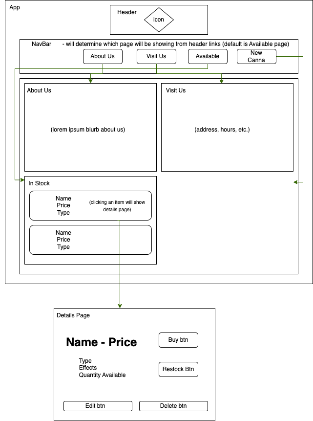
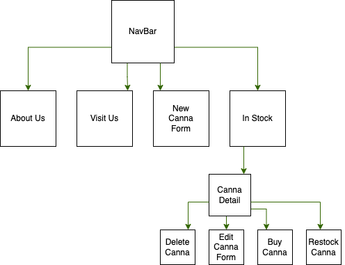

# Canna Site

#### By E. Luckie ☀️

#### This site was created to practice using React to make single-page sites that use local and shared state to be dynamic.

## Technologies Used

* React
* JSX
* JavaScript
* Markdown
* Git

## Description

Build a website for selling merchandise for a band, author, sports team, or any other purveyor that interests you.

A user should be able to do the following:

* Create, Read, Update and Delete items in the store. Items should have fields for ``name``, ``description``, and ``quantity`` (along with any other fields you wish to add).
* Increase or decrease the ``quantity`` of an item in the store. For instance, if a user clicks "Buy", the ``quantity`` will decrease by one. If a user clicks "Restock", it will increment by a specified number.
* When the ``quantity`` of an item is reduced to ``0``, the item should say "Out of Stock". A user should not be able to reduce the ``quantity`` of an item below ``0``.

## Site Diagram


## Component Diagram


## Setup/Installation Requirements

1. Clone this repository to your desktop
2. Navigate to the top level of this directory in your computer’s terminal
3. Run the code ```npm install``` in your terminal to install the necessary packages and plug-ins
4. Run the code ```npm run start``` in your terminal to start the application in development mode and open the project in your web browser

## Known Bugs

* No known bugs.

## Stretch Plans

* Create a ``Cart`` component. When a user clicks "Buy", the specified item should be added to the cart.
* A user should be able to view and remove items from the cart.
* Create a widget that shows the number of items in the cart. This widget should be updated when items are added to the cart.

## License

MIT License

Copyright (c) 2023 Luckie

______________

This project was bootstrapped with [Create React App](https://github.com/facebook/create-react-app).